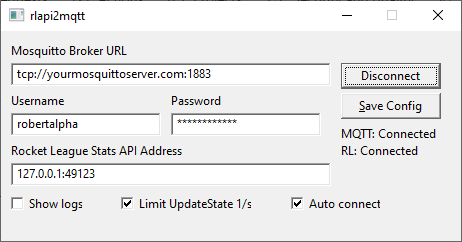
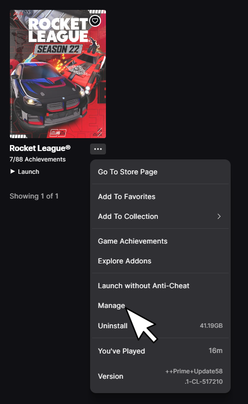
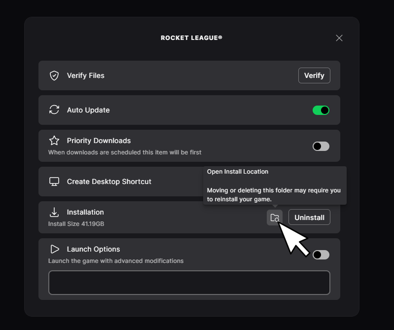
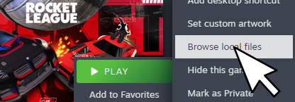

<picture>
  <source media="(prefers-color-scheme: dark)" srcset="docs/rlapi2mqtt_dark.png">
  <source media="(prefers-color-scheme: light)" srcset="docs/rlapi2mqtt_light.png">
  
</picture>

A lightweight Windows desktop application that bridges the [Rocket League Stats API](https://www.rocketleague.com/en/developer/stats-api) WebSocket to an MQTT broker.

It connects to the game's local WebSocket, receives real-time events (goals, demolitions, stat updates, etc.) and publishes them to configurable MQTT topics under `rlapi2mqtt/`.

This way you can easily consume the events in other applications, for example to trigger announcements or other actions.

An example consumer is [rocketleague-announcer](https://github.com/robertalpha/rocketleague-announcer).

## Communication Flow

```
                                                          ┌─────────────────────────┐
                                                     ┌───>│    eventlogger          │
                                                     │    │    (example consumer)   │
┌────────────────┐ WebSocket ┌────────────┐  MQTT  ┌─┴──┐ └─────────────────────────┘
│ Rocket League  │──────────>│ rlapi2mqtt │───────>│MQTT│
│     Game       │  :49123   │ (this app) │        │    │ ┌─────────────────────────┐
└────────────────┘           └────────────┘        └─┬──┘ │ rocketleague-announcer  │
                                                     │    │    (example consumer)   │
                                                     └───>└─────────────────────────┘
```

## Screenshot



## How to Use

This guide assumes you have a running MQTT broker, for instance [Eclipse Mosquitto](https://mosquitto.org/), with valid credentials.

### 1. Enable the Rocket League Stats API

Follow the instructions on the [Rocket League Stats API page](https://www.rocketleague.com/en/developer/stats-api) to enable the socket:

1. Browse to the Rocket League installation folder 
   1. *Epic*   
      click Rocket League -> ... -> Manage  
        
      Click the Folder icon    
        
   2  *Steam*  
      right-click Rocket League -> Manage -> Browse Local Files    
      

2. Navigate to `TAGame/Config/`
3. Open `DefaultStatsAPI.ini` with a text editor and set `PacketSendRate=4` (anything 1 or higher works, but keeping it under 10 is recommended for performance)
4. Save the file

The Stats API socket is now open to connections from `rlapi2mqtt` when the Rocket League game is running (restart if already running).

### 2. Download rlapi2mqtt

Download the latest release from [GitHub Releases](https://github.com/robertalpha/rlapi2mqtt/releases).

Extract the zip and run `rlapi2mqtt.exe` from the same PC where Rocket League is running.

### 3. Connect

Fill in the MQTT broker URL and credentials, then press **Connect**. The application will connect to both the MQTT broker and Rocket League's Stats API socket. Check the **Auto connect** checkbox and press **Save Config** to automatically connect on next startup.

## Configuration

You can use the UI to configure. To use it on next startup use the `Save config` button to store the credentials in a `rlapi2mqtt.ini` in the same directory.

```ini
MQTT_URL=tcp://localhost:1883
MQTT_USERNAME=user
MQTT_PASSWORD=password
RL_ADDRESS=127.0.0.1:49123
AUTO_CONNECT=false
```

All fields can also be filled in through the GUI at runtime.

## Build

Requires Go 1.26+. The application targets Windows only (uses [windigo](https://github.com/rodrigocfd/windigo) for the native GUI).

```sh
make build
```

This produces `rlapi2mqtt.exe`.

## Reference

This project is inspired by the end-of-life Bakkes Plugin RL2MQTT made by Janoz-NL found here: [RL2MQTT](https://github.com/Janoz-NL/RL2MQTT)