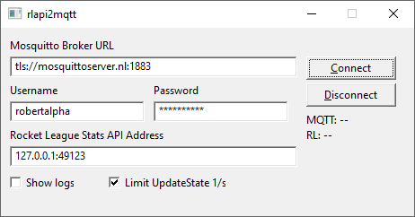

# rlapi2mqtt

A lightweight Windows desktop application that bridges the [Rocket League Stats API](https://www.rocketleague.com/en/developer/stats-api) WebSocket to an MQTT broker.

It connects to the game's local WebSocket, receives real-time events (goals, demolitions, stat updates, etc.) and publishes them to configurable MQTT topics under `rlapi2mqtt/`.

This way you can easily consume the events in other applications, for example to trigger announcements or other actions.

An example consumer is [rocketleague-announcer](https://github.com/robertalpha/rocketleague-announcer).

## Communication Flow

```
                                                          ┌─────────────────────────┐
                                                     ┌───>│    eventlogger          │
                                                     │    │    (consumer)           │
┌────────────────┐ WebSocket ┌────────────┐  MQTT  ┌─┴──┐ └─────────────────────────┘
│ Rocket League  │──────────>│ rlapi2mqtt │───────>│MQTT│
│     Game       │  :49123   │ (this app) │        │    │ ┌─────────────────────────┐
└────────────────┘           └────────────┘        └─┬──┘ │ rocketleague-announcer  │
                                                     │    │    (consumer)           │
                                                     └───>└─────────────────────────┘
```

## Screenshot



## Configuration

You can use the UI to configure. To use it on next startup use the `Save config` button to store the credentials in a  `rlapi2mqtt.ini` in the same directory.

```ini
MQTT_URL=tcp://localhost:1883
MQTT_USERNAME=user
MQTT_PASSWORD=password
RL_ADDRESS=127.0.0.1:49123
```

All fields can also be filled in through the GUI at runtime.

## Build

Requires Go 1.26+. The application targets Windows only (uses [windigo](https://github.com/rodrigocfd/windigo) for the native GUI).

```sh
make build
```

This produces `rlapi2mqtt.exe`.
